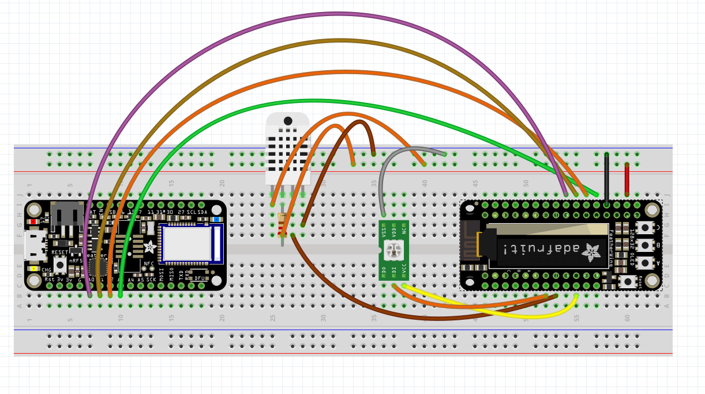
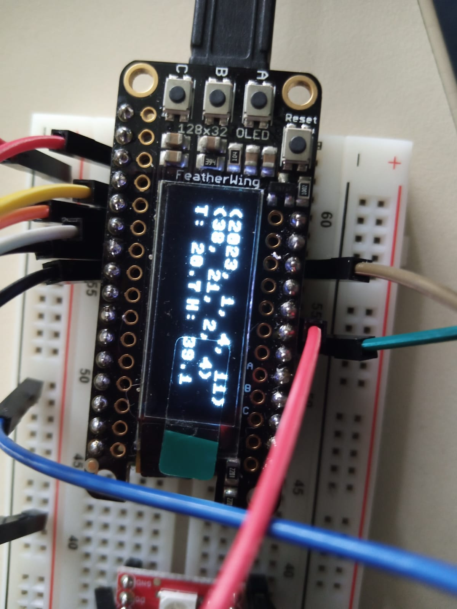
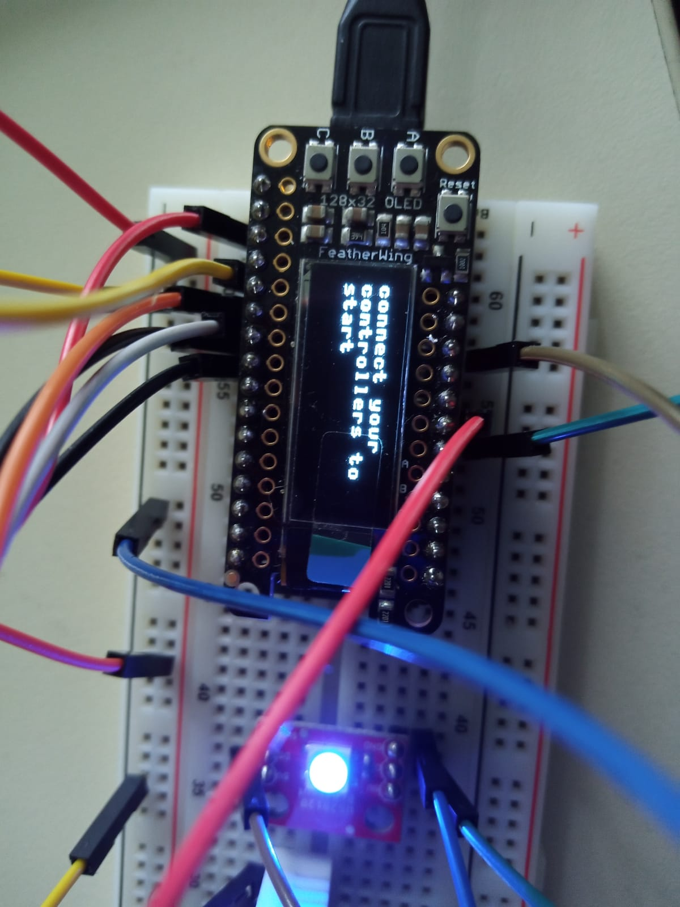
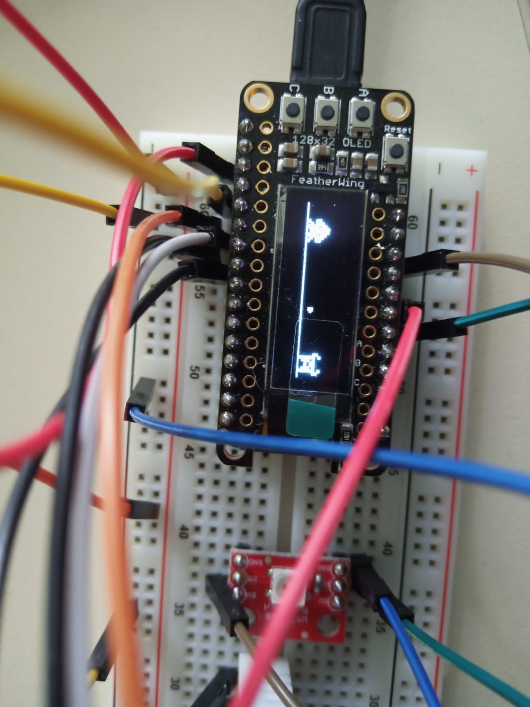
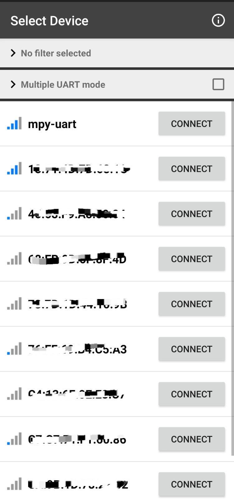
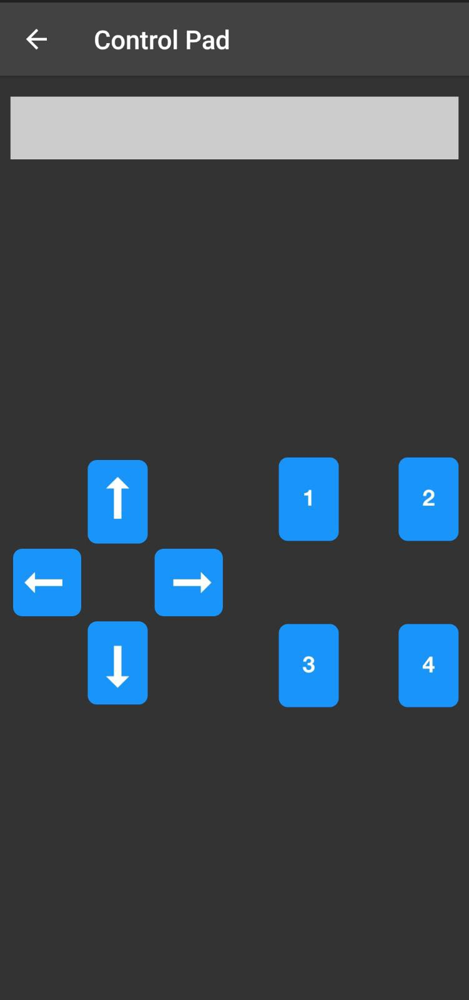
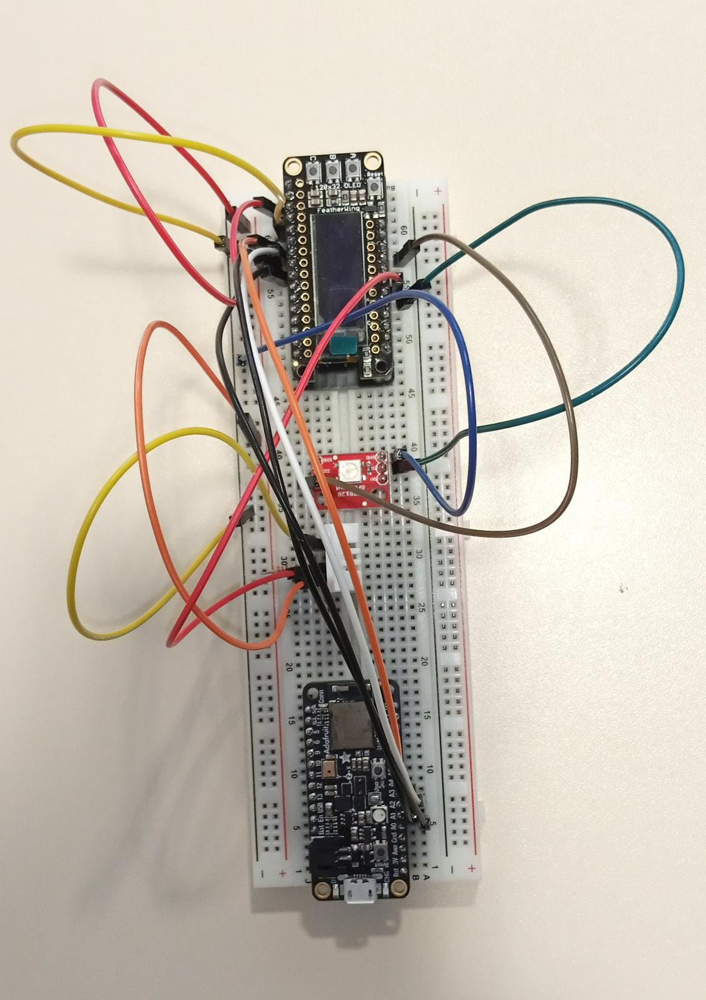
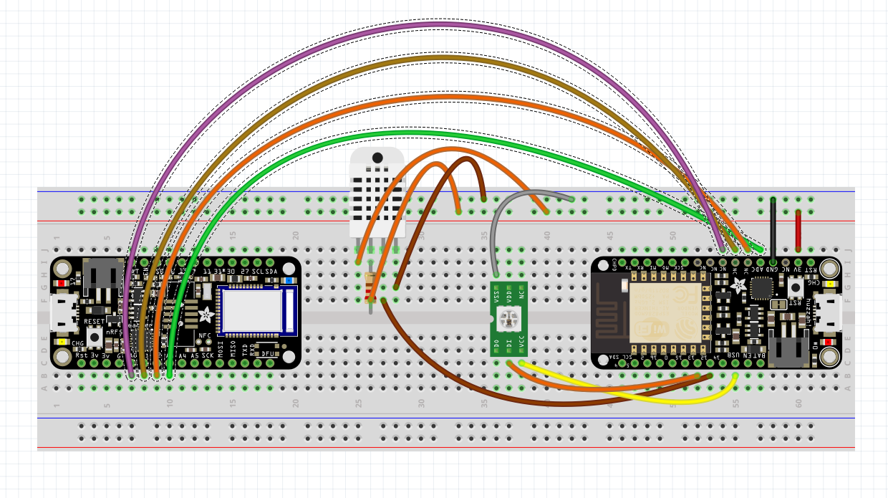

# 2-Player Shooter Game

This is a 2-player shooter game developed using MicroPython on an ESP32 microcontroller. The game is controlled using two phones, which connect to the ESP32 and Adafruit Circuit Python board via Bluetooth. The game is displayed on a 32x128 Adafruit FeatherWing OLED display.

Before starting the game, a homescreen is displayed showing the time and date, as well as the temperature and humidity. The time and date are set to the current time by connecting the device to WiFi. A light blinks during the Bluetooth connection phase using uasyncio. 

To start the game, the player can click the A button on the OLED screen.

Each player controls an 8-bit designed monster which can jump, move right and left, and shoot a bullet.

## Photos
- The HomeScreen displayed on the OLED screen before starting the game.

- Connecting to Bluetooth using two phones.

- Gameplay of the 2-player shooter game.

- Bluetooth connecting from phone to ESP32.

- Phone controller

- Circuit of the ESP32, Adafruit board, and OLED display.

## Hardware Requirements
- ESP32 microcontroller
- Adafruit feather board
- 32x128 Adafruit FeatherWing OLED display
- DHT22 temperature and humidity sensor
- WS2812B Breakout RGB led
- Breadboard and wires
- Resistor (220 Mohm)
- 2 phones with Bluetooth capability
- WiFi network

## Software Requirements
- MicroPython firmware for the ESP32
- CircuitPython firmware for the Adafruit board
- ssd1306.py library for the OLED display
- I2Capserver.py library for the bluetooth connection
- Bluefruit Connect phone application

## Setup
1. Flash the ESP32 with the MicroPython firmware.
2. Flash the Adafruit board with the CircuitPython firmware.
3. Connect the Adafruit board to the ESP32 using 4 wires for the 4 different action options of the player.
4. Connect the OLED display to the ESP32 board.
5. Connect the DHT22 sensor to the ESP32 board.
6. Connect the two phones to the ESP32 and Adafruit board via Bluetooth using Bluefruit Connect.
   

## Gameplay
The objective is to eliminate the other player's monster. The monsters can be controlled using the phones as gamepads. Each monster has the ability to jump, move right and left, and shoot a bullet. The game is over when one player's monster is defeated.

## Notes
- Make sure the ESP32, Adafruit board, and OLED display are properly connected and powered on before attempting to connect the phones.
- Refer to the MicroPython and CircuitPython documentation for instructions on how to flash the firmware, connect to WiFi, and connect to Bluetooth devices.